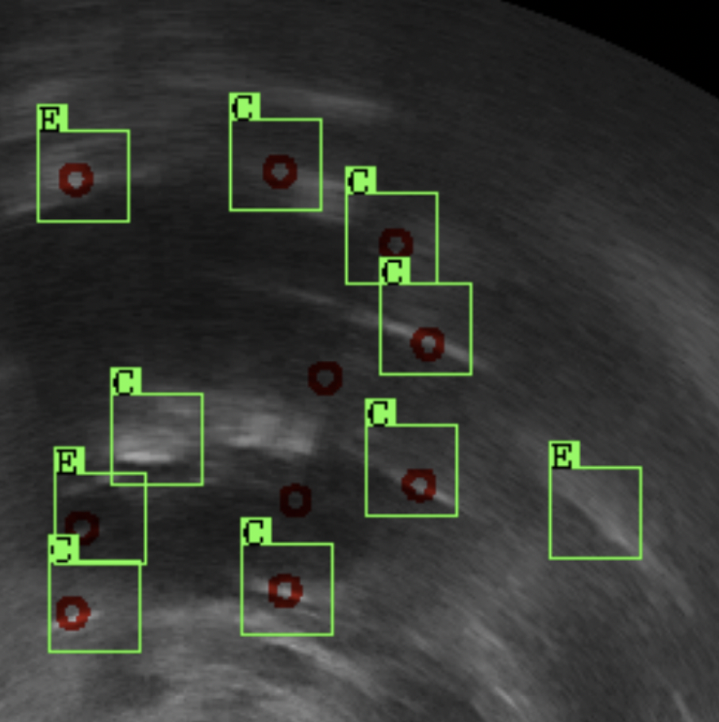

## Implementation of Thesis Project:

## Image Detection and Segmentation- Distinguishing Catheters from their Echoes in Medical Ultrasound images

<hr>

### Project Structure:


### Import Libraries:


```python
# Importing libraries
import numpy as np
import pandas as pd
import torch
import torch.nn as nn
import cv2
...
...
```

    Using PyTorch Version 1.4.0


### Feature Map Computation Summary:

#### Feature: Compute spectral rotation angle given r, c


```python
# Compute spectral rotation angle given r,c
def spectral_rotation_angle(r, c):
    x = r - (N / 2)
    y = (N / 2) - c
    q = 0 if x == 0 or y == 0 else (y / x)
    phase = math.atan(q)
    return phase
```

#### Feature: Computing spectral deviation angle


```python
# Computing spectral deviation angle
def compute_theta(p1, p2, p3):
    # p1(x1,y1)
    # p2(x2,y2)
    # p3(x3,y3)
    HX1 = []
    HX2 = []
    
    HX1.append(p1[0]-5) # x1 0
    HX1.append(p1[1]) # y1 1
    HX1.append(p1[0]+5) # x2 2
    HX1.append(p1[1]) # y2 3
    
    HX2.append(p2[0]-5)
    HX2.append(p2[1])
    HX2.append(p2[0]+5)
    HX2.append(p2[1])
    
    M1 = (HX1[3]-HX1[1])/(HX1[2]-HX1[0]) # Slope of HX1
    M2 = (p2[1]-p1[1])/(p2[0]-p1[0]) # Slope of p1p2
    M3 = (HX2[3]-HX2[1])/(HX2[2]-HX2[0]) # Slope of HX2
    M4 = (p3[1]-p2[1])/(p3[0]-p2[0]) # Slope of p2p3
    
    TAN1 = abs((M2-M1)/(1+M1*M2))
    THETA1 = math.atan(TAN1)
    
    TAN2 = abs((M4-M3)/(1+M3*M4))
    THETA2 = math.atan(TAN2)
    
    # For negative slope, THETA1 is negative
    if M2 < 0:
        THETA1 = -THETA1
        
    if p3[1] < p2[1]:
        THETA2 = -THETA2
    
    THETA3 = THETA2-THETA1
    
    #OBJ.append(THETA3)
    
    return THETA3
```

#### Feature: Compute sector index


```python
# Compute sector index
def compute_sector(phase):
    phase_d = abs(np.degrees(phase))
    #print(phase_d)
    v = (phase_d/22.5)//1 #get only integer
    if v == 16:
        return 0
    return v


#### Feature: Compute distance given r, c
# Compute distance given r,c
def compute_distance(r, c):
    x = r - (N / 2)
    y = (N / 2) - c
    d = math.sqrt(x*x+y*y)
    return d
```

### Classifier Parameters and Hyperparameters:


```python
# Hyper-parameter settings
TOTAL_EPOCH = 20
LEARNING_RATE = 0.001
MOMENTUM = 0.9
BATCH_SIZE = 11

class_arr = [0,1]
data_source = 'ounet' # ounet: unet output data, native: 
```

### Select patients randomly:


```python
from training.data_loader import *
from testing.data_loader import *

# Random data set select 
sampled_list, train_items = select_random_patient(20)
sampled_list, test_items = select_random_patient_test(20)

print(sampled_list)
```

    [9, 6, 1, 16, 74, 44, 52, 2, 43, 35, 17, 31, 51, 64, 13, 53, 75, 100, 78, 67]


### Load Training Data:


```python
test_feature_map, test_classes, test_files_title = load_test_dataset()
```

    Loading train data...
    4642
    Done!


### Convert numpy array of Training Data into Data Frame:


```python
# Convert to pandas
pd_dataset = pd.DataFrame({'Freq. Coeff.': mags, 'Spec. Rot.': phases, 'Spec. Dev.': sigs, 'Sector': sectors, 'Distance': distances})
pd_dataset.head(10)
```


<div>
<style scoped>
    .dataframe tbody tr th:only-of-type {
        vertical-align: middle;
    }

    .dataframe tbody tr th {
        vertical-align: top;
    }

    .dataframe thead th {
        text-align: right;
    }
</style>
<table border="1" class="dataframe">
  <thead>
    <tr style="text-align: right;">
      <th></th>
      <th>Freq. Coeff.</th>
      <th>Spec. Rot.</th>
      <th>Spec. Dev.</th>
      <th>Sector</th>
      <th>Distance</th>
    </tr>
  </thead>
  <tbody>
    <tr>
      <th>0</th>
      <td>0.898911</td>
      <td>0.000000</td>
      <td>-1.302566</td>
      <td>0.0</td>
      <td>0.000000</td>
    </tr>
    <tr>
      <th>1</th>
      <td>0.186340</td>
      <td>-0.218669</td>
      <td>0.708626</td>
      <td>0.0</td>
      <td>18.439089</td>
    </tr>
    <tr>
      <th>2</th>
      <td>0.185555</td>
      <td>-0.218669</td>
      <td>0.437338</td>
      <td>0.0</td>
      <td>18.439089</td>
    </tr>
    <tr>
      <th>3</th>
      <td>0.110231</td>
      <td>-0.321751</td>
      <td>0.682317</td>
      <td>0.0</td>
      <td>31.622777</td>
    </tr>
    <tr>
      <th>4</th>
      <td>0.110164</td>
      <td>-0.321751</td>
      <td>0.141897</td>
      <td>0.0</td>
      <td>31.622777</td>
    </tr>
    <tr>
      <th>5</th>
      <td>0.100436</td>
      <td>0.000000</td>
      <td>0.030294</td>
      <td>0.0</td>
      <td>19.000000</td>
    </tr>
    <tr>
      <th>6</th>
      <td>0.099856</td>
      <td>0.000000</td>
      <td>0.000000</td>
      <td>0.0</td>
      <td>19.000000</td>
    </tr>
    <tr>
      <th>7</th>
      <td>0.066827</td>
      <td>-0.293589</td>
      <td>0.000000</td>
      <td>0.0</td>
      <td>44.922155</td>
    </tr>
    <tr>
      <th>8</th>
      <td>0.066812</td>
      <td>-0.293589</td>
      <td>0.933359</td>
      <td>0.0</td>
      <td>44.922155</td>
    </tr>
    <tr>
      <th>9</th>
      <td>0.050743</td>
      <td>0.000000</td>
      <td>0.766496</td>
      <td>0.0</td>
      <td>35.000000</td>
    </tr>
  </tbody>
</table>
</div>


### Visualization of Correlation Matrix:


```python
# Correlation between columns
corr_matrix = pd_dataset.corr()
plt.figure(figsize=(9, 8))
sns.heatmap(data = corr_matrix,cmap='coolwarm', annot=True, linewidths=0.2)
```


    <matplotlib.axes._subplots.AxesSubplot at 0x2350a17d188>


    


### Fully connected Neural Networks Layer:


```python
# Fully Connected Neural Network (FCCN) Architecture
import torch.nn as nn
import torch.nn.functional as F

class Net(nn.Module):
    def __init__(self):
        super(Net, self).__init__()
        
        self.classifier = nn.Sequential(
            
            nn.Linear(120, 50),
            nn.BatchNorm1d(50),
            nn.Dropout(0.30),
            nn.ReLU(),

            nn.Linear(50, 50),
            nn.BatchNorm1d(50),
            nn.Dropout(0.30),
            nn.ReLU(),
            
            nn.Linear(50, 40),
            nn.BatchNorm1d(50),
            nn.Dropout(0.2),
            nn.ReLU(),
            
            nn.Linear(40, 30),
            nn.BatchNorm1d(40),
            nn.Dropout(0.1),
            nn.ReLU(),

            nn.Linear(30, 15),
            nn.BatchNorm1d(15),
            nn.Dropout(0.1),
            nn.ReLU(),

            nn.Linear(15, 10),
            nn.BatchNorm1d(15),
            nn.Dropout(0.1),
            nn.ReLU(),
            
            nn.Linear(10, 2),
            #nn.Softmax(dim=1)
            nn.Sigmoid()
        )

    
    def forward(self, x):
        x = x.view(-1, 120)
        
        x = self.classifier(x)
        
        return x
```

### Generate Batch of Training Features and Classes:


```python
from training.batch import *

batch_features, batch_classes, classes = generate_training_batch()
```


    torch.Size([422, 11, 120, 1])


### Set training device: GPU:


```python
# Set training device: CPU or GPU
device = torch.device("cuda:0" if torch.cuda.is_available() else "cpu")
#device = "cpu"
print(device)
```

    cuda:0


### Loss Function:


```python
# Loss function configuration
import torch.optim as optim
criterion = nn.CrossEntropyLoss()
optimizer = optim.SGD(net.parameters(), lr=LEARNING_RATE, momentum=MOMENTUM, weight_decay=0.001) #, weight_decay=0.001
```

### Model Training:


```python
# Training data on GPU
from training.train import *

train_loss, train_accuracy = train_model()
```

    EPOCH 1/20: Batch 422/422
    EPOCH 1/20(DONE): Loss = 0.6776466520759167  Accuracy = 0.6111589831968979 (GPU: cuda:0 - GeForce GTX 1050)
    
    EPOCH 2/20: Batch 422/422
    EPOCH 2/20(DONE): Loss = 0.6776466520759167  Accuracy = 0.6111589831968979 (GPU: cuda:0 - GeForce GTX 1050)
    
    EPOCH 3/20: Batch 422/422
    EPOCH 3/20(DONE): Loss = 0.6776466520759167  Accuracy = 0.6111589831968979 (GPU: cuda:0 - GeForce GTX 1050)
    
    ...
    ...


### Visualization of Training Loss and Accuracy:


```python
from results_and_analysis.results_visualization import *

visualize_training_loss_accuracy(train_loss, train_accuracy)
```


### Initialize UNET output before loading as Test data:


```python
from testing.unet_output_data_load import *

sampled_list, unet_pred_full, test_items = prepare_unet_sample_list()
```

    [9, 67, 90, 81, 108, 124, 146, 99, 1, 21, 16, 88, 14, 6, 94, 145, 66, 14, 91, 130, 37, 147, 131, 85, 130, 157, 134, 143, 104, 6, 45, 104, 6, 56, 163, 2, 119, 175, 81, 146, 37, 147, 90, 24, 146, 145, 102, 45, 175, 134, 91, 66, 108, 2, 81]


### Load Test Data:


```python
from testing.data_loader import *

test_feature_map, test_classes, test_files_title = load_test_dataset()
```

    Loading test data...
    11635
    Done!


```python
img_slices = get_mapped_image_slices()
```

    6660


### Map UNET Output Data:


```python
unet_prediction_accuracies = map_unet_output()
```

    Reading...
    Done!


### Generate Predicted Probability for Test Data:


```python
from testing.predict import *

outputs = predict()
_, predicted = torch.max(outputs, 1)
nd_predict = predicted.cpu().numpy()
```

    tensor([[0.5212, 0.4060],
            [0.2479, 0.7015],
            [0.5775, 0.3875],
            ...,
            [0.5652, 0.3797],
            [0.0066, 0.9936],
            [0.2766, 0.6786]], device='cuda:0', grad_fn=<SigmoidBackward>)


### Compute Test Accuracy:


```python
from testing.predict import *

accuracy = compute_accuracy(outputs)
```

    Computing accuracy...
    Accuracy on 11635 testset: 0.7589


### Compare Unet and PFCNN results


```python
from results_and_analysis.results_comparison import *

compare_unet_pfcnn_results(unet_prediction_accuracies, pred_accuracy_dict, t_out)
```

    REPORTING FOR E LIST:
    
    Higher confidence in PFCNN than unet: 0 roi out of 11635
    Lower confidence in Probing FCNN than unet: 11635 roi out of 11635
    
    Average higher difference of confidence (D1): 0.20618377498093005
    Average lower difference of confidence (D2): -0.5122380955460709
    Difference (D1 - D2): -0.30605432056514087
    
    Average higher confidence: 0.9145799951595404
    Average lower confidence: 0.1228411159502727
    
    Average confidence in unet: 0.6350792114963449
    Average confidence in pfcnn: 0.1228411159502727
    Their difference (pfcnn-unet): 0.5122380955460722
    
    Equal confidence in Probing FCNN and unet: 0 out of 11635
    ###################
    
    


```python
from results_and_analysis.results_comparison import *

pfcnn_confidence_vs_unet_confidence_plotting(pred_accuracy_dict, unet_prediction_accuracies)
```


    
### Combining Output of two Classifier:


```python
from testing.combined_output import *

compute_pfcnn_combined_accuracy(pred_accuracy_dict, unet_prediction_accuracies, t_out, test_classes)
```

    Accuracy on 2089 testset: 0.7042


```python
from results_and_analysis.results_comparison import *

results = get_confusion_matrix(nd_predict, test_classes)
```

    Confusion Matrix :
    [[   56     5]
     [ 4489 16559]]


```python
from output.write_output import *

status = bulk_write(test_files_title, nd_predict)
```

### Predicted output sample


Ref. 

References can be found in "REFERENCES" section in the "Thesis_MSc_Final_Version_ID-200397872.pdf" file
